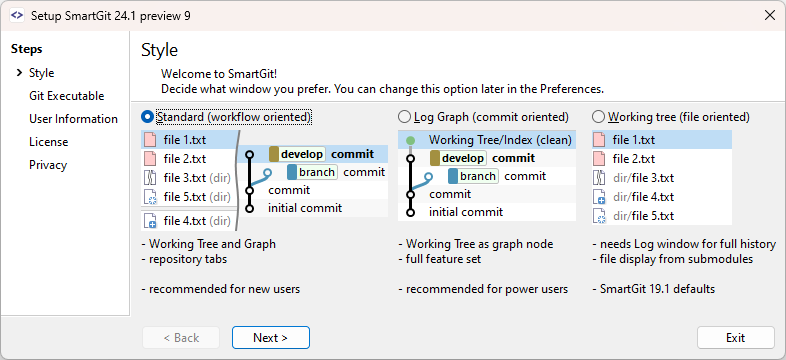

# Chapter 5: The 3 faces of SmartGit

## Summary
This is meant to give an overview of the 3 different Window/Workflow Styles SmarGit provides for it's customers.
## SmartGit comes in 3 flavors.

## Intention
### Standard window
- Provide a rather restricted/constrained UI around Git best practices to
	- avoid some potential problematic situations
	- make it easier for organizations that need to document and certify their processes
- simple for new Git users and powerful for power users
- advanced GitHub integration features
- configuration only were necessary, e.g. toolbars optimized for different views
- make common workflows easier (=> less common workflows may be somewhat harder)
### Log window
- all features for power users with full freedom
- "get complex tasks done with ease" [MS: that is true for all windows; but specifically in comparison with the other windows I disagree]
### Working Tree window
- provide an intuitive interface if you are used to work in a file system oriented fashion

## Target Users
### Standard window
- New Users (less experienced Git users)
- Power Users (who want to avoid pitfalls)
- Organizations that need to prove/document how they use Git
### Log window
- Power Users (experienced Git users who prefer more freedom)
- “Merge Meisters”
### Working Tree window
- Power User (with focus on local (changed) files)
- Submodule Users