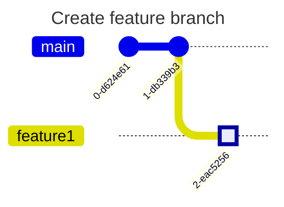
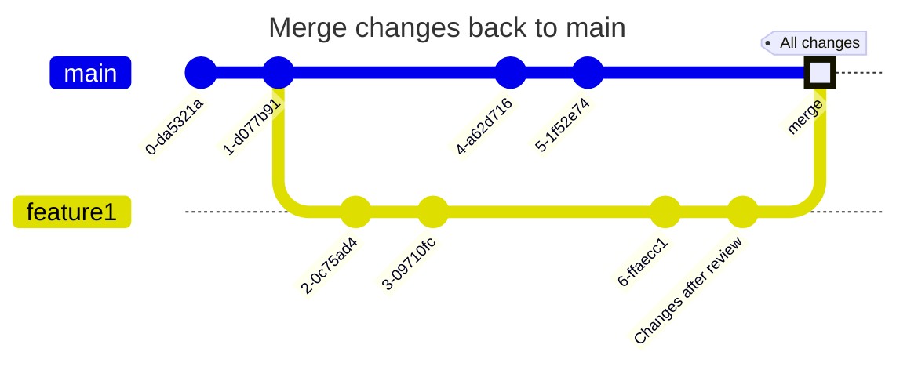

# Chapter 6: Step by Step GitHub Flow

## Summary
We use GitHub Flow as a relatively simply best practice workflow that works great with modern Git environments. See the official documentation: https://docs.github.com/en/get-started/using-github/github-flow

## Initial git repository creation

## Create feature branch

## Work on feature branch

## Others bring change to the main branch

## Review changes

## Merge changes back to main

## Our changes are now included in the new mainline

